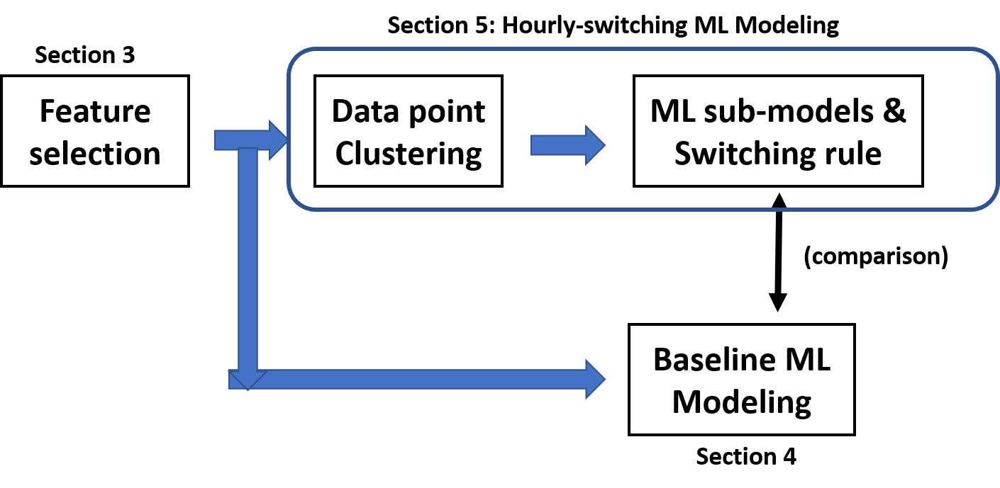
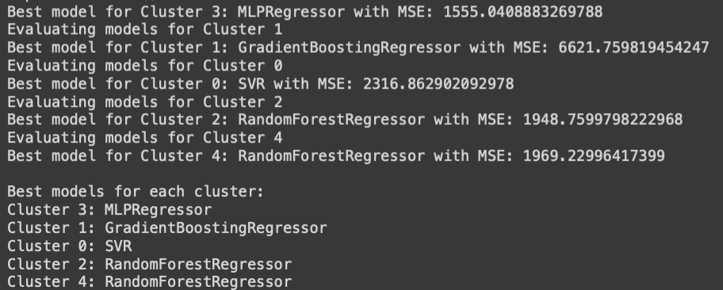

# An Hourly-Switching Machine Learning Model for Solar Radiation Prediction

This repository contains the source code for our research on predicting hourly solar radiation (SR) using publicly available online weather forecast data and machine learning techniques.

  

## Overview

Accurate prediction of solar radiation is critical for maximizing the efficiency of solar energy systems, such as photovoltaic (PV) and thermal setups. However, a static single model often fails to capture the distinct physical behaviors of solar radiation during specific periods, such as rapid atmospheric changes at sunrise or peak intensity at solar noon. 

To address this, we propose an **hourly-switching machine learning model**. By leveraging K-means clustering on an optimal set of weather features (specifically `uvindex`, `feelslike`, and `Hour`), the hourly data is segmented into distinct environmental regimes. 

  
  
<em>Figure: Solar Panel Setup at UBC for Data Collection</em>

### Methodology

1. **Feature Selection**: Using Pearson correlation and iterative feature combination testing across different models, we reduce 14 potential weather elements to the 3 most impactful features (`uvindex`, `feelslike`, `Hour`) to prevent overfitting and noise.
2. **K-Means Clustering**: We discretize weather conditions into clusters. This ensures that each hour's prediction is handled by an algorithm specifically optimized for that environmental state (e.g., high humidity vs. high UV index).
3. **Hourly-Switching Logic**: We train multiple ML sub-models (Artificial Neural Network, Support Vector Machine, Gradient Boosting Regression, Random Forest, Simple Linear Regression) within each cluster. The system dynamically switches between sub-models based on the real-time environmental state, assigning the most competent expert model to each regime.

  

## Repository Structure

The repository is organized to house the core code used in our experiments:

* **`code/`**: Contains the Python Jupyter Notebooks (`.ipynb`) used for feature selection, correlation analysis, K-means clustering, and training/testing the various machine learning models. Note: Due to privacy and size constraints, raw data files (`.csv`, `.json`) are not included in this repository.
* **`images/`**: Contains select diagrams, charts, and photos from the original paper explaining the methodology and setup.

## Authors
- **Shentong Li** (University of Waterloo) 
- **Ryozo Nagamune** (University of British Columbia)

## Contact
For any questions regarding the code or paper, please feel free to reach out to the corresponding authors.
